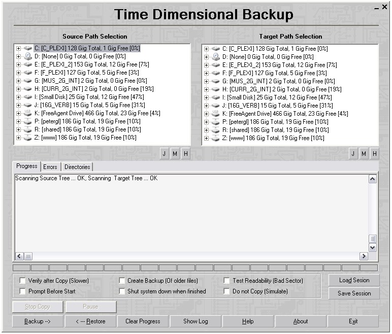

# Timedim, Time dimensional copy machine.

 
   This windows application will copy source dir to target dir. Ignores older or matching files.
It is a successor for dcp32, with GUI. The left dir view is source, the right dir view is target.

  I use it every hour, as it only copies changed files, it is fast.
  
  Command line invocation:
  
    It can repeat an existing session. The GUI behaves like an automated program
when started from the command line. All actions are interruptible.

 Options:   (windows convention used)
 
   */p    prompt before start
   */b    backup old file
   */s    simulate copy (what would it do)
   */v    verify on
   */r    shutdown when done

  Note" some of the souce files are redundant is VS2015, I left them in that an
   #if 0 so the project can recompile on old compilers.
   
   

